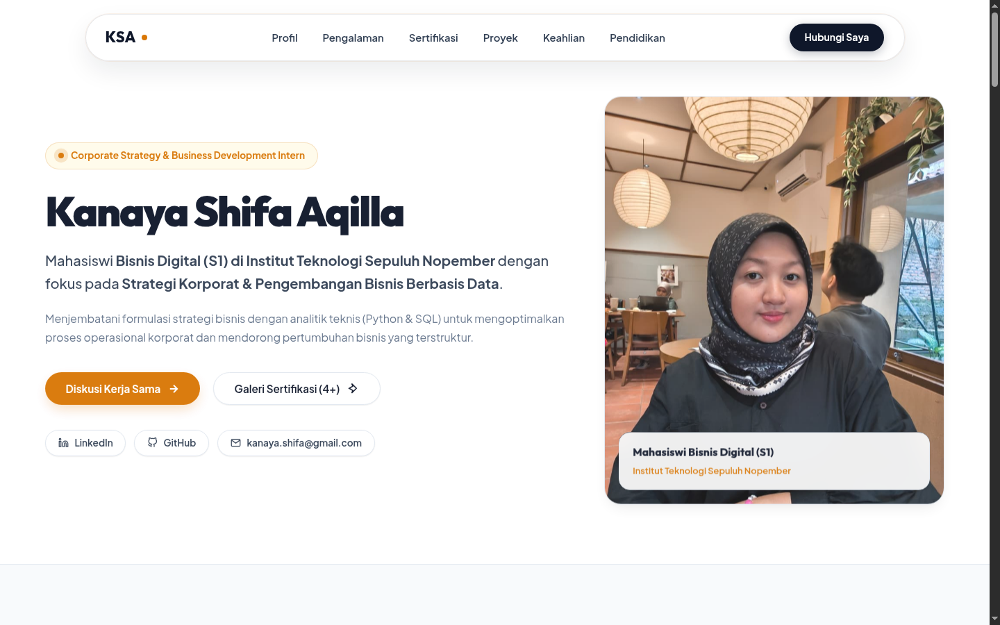
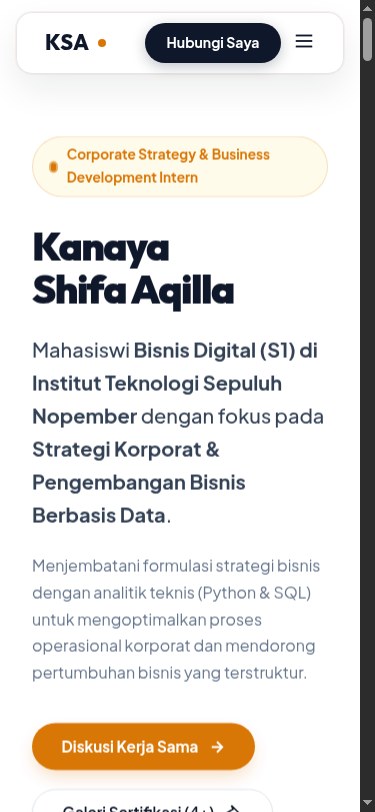

# Portfolio - Kanaya Shifa Aqilla

Portofolio digital interaktif dan responsif Kanaya Shifa Aqilla - Corporate Strategy & Business Development Intern at PT Pertamina Lubricants & Mahasiswi Bisnis Digital (S1) di Institut Teknologi Sepuluh Nopember (ITS) Surabaya.

---

## Tentang Proyek Ini

Proyek ini adalah website portofolio eksekutif interaktif yang dirancang untuk menampilkan profil profesional, riwayat pendidikan di ITS (IPK 3.81), pengalaman magang di PT Pertamina Lubricants, lisensi & sertifikasi terverifikasi, proyek publikasi/kompetisi, serta kegiatan relawan pengabdian masyarakat. Website ini dibangun dengan arsitektur bersih tanpa framework berat sehingga cepat diakses, responsif di semua perangkat, dan siap dideploy secara live.

---

## Tautan Penting Pengumpulan Tugas

- **URL Live Website:** [https://portfolio-kanaya-shifa-aqilla.vercel.app](https://portfolio-kanaya-shifa-aqilla.vercel.app/)
- **Link Repositori GitHub:** [https://github.com/kanayashifa-cell/Portfolio-KanayaShifaAqilla.git](https://github.com/kanayashifa-cell/Portfolio-KanayaShifaAqilla.git)

---

## Panduan Menjalankan Project Secara Lokal & Deployment

### 1. Cara Clone & Menjalankan Project Secara Lokal

1. Clone repositori dari GitHub:
   ```bash
   git clone https://github.com/kanayashifa-cell/Portfolio-KanayaShifaAqilla.git
   ```
2. Masuk ke direktori proyek:
   ```bash
   cd Portfolio-KanayaShifaAqilla
   ```
3. Jalankan server lokal sederhana (menggunakan Python):
   ```bash
   python3 -m http.server 8083
   ```
4. Buka peramban (browser) dan akses URL:
   `http://localhost:8083`

---

### 2. Langkah Push ke GitHub

1. Buka terminal di folder proyek:
   ```bash
   cd Portfolio-KanayaShifaAqilla
   ```
2. Inisialisasi Git dan lakukan commit:
   ```bash
   git init
   git add .
   git commit -m "feat: portfolio kanaya shifa aqilla"
   ```
3. Hubungkan ke repositori GitHub dan lakukan push:
   ```bash
   git branch -M main
   git remote add origin https://github.com/kanayashifa-cell/Portfolio-KanayaShifaAqilla.git
   git push -u origin main
   ```

---

### 3. Langkah Deploy Gratis ke Vercel

1. Buka situs [Vercel](https://vercel.com) dan login menggunakan akun GitHub.
2. Klik tombol **"Add New"** > **"Project"**.
3. Pilih repositori **`Portfolio-KanayaShifaAqilla`** yang sudah di-push.
4. Pada bagian *Framework Preset*, pilih **Other** (HTML/CSS/JS murni).
5. Klik **"Deploy"**. Vercel akan menerbitkan URL live resmi dalam beberapa detik.

---

## Tangkapan Layar Tampilan

| Tampilan Utama (Desktop Hero) | Tampilan Responsif (Mobile HP) |
| :---: | :---: |
|  |  |

---

## Struktur Direktori Proyek

```
Portfolio-KanayaShifaAqilla/
├── index.html            # Halaman utama portofolio
├── css/
│   ├── variables.css     # Design tokens (warna, tipografi, grid max-width)
│   └── style.css         # Stylesheet utama & responsive breakpoints
├── js/
│   └── script.js         # GSAP ScrollTrigger, 3D tilt, filter tab, & modal lightbox
├── assets/
│   ├── profile/          # Foto profil asli
│   ├── certificates/     # File sertifikat & bukti pendukung
│   └── screenshots/      # Tangkapan layar untuk README & pengumpulan
├── .gitignore            # Pengabaian file build / temporary / rahasia
├── LICENSE               # Berkas Lisensi MIT resmi
└── README.md             # Dokumentasi proyek portofolio
```

---

## Teknologi yang Digunakan

- **HTML5 & CSS3 Vanilla:** Struktur semantik dan styling custom murni tanpa Tailwind/framework CSS agar lebih fleksibel dan berperforma tinggi.
- **JavaScript (ES6+):** Logika modal lightbox, filter tab sertifikat, dan kontrol kelas UI.
- **GSAP 3.x & ScrollTrigger:** Animasi entrance & scroll reveal yang halus.

---

## Lisensi

Proyek ini dilisensikan di bawah **MIT License**. Lihat berkas `LICENSE` untuk rincian lengkap.

---
&copy; 2026 Kanaya Shifa Aqilla.
